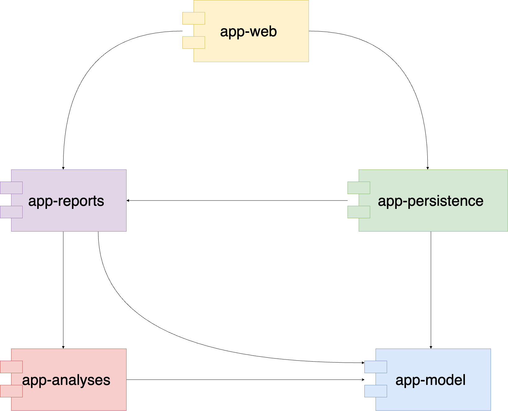

# 2. Use Gradle multi-project

Date: 2023-10-16

## Status

Accepted

## Context

We envision a considerable growth in the project.
Separating modules allows independent builds.

## Decision

Split the code-base into different Gradle projects

## Consequences

Faster builds due to a more granular access to it.
Team-wise scalability is improved.

## Illustration

Relationship between the Gradle projects

