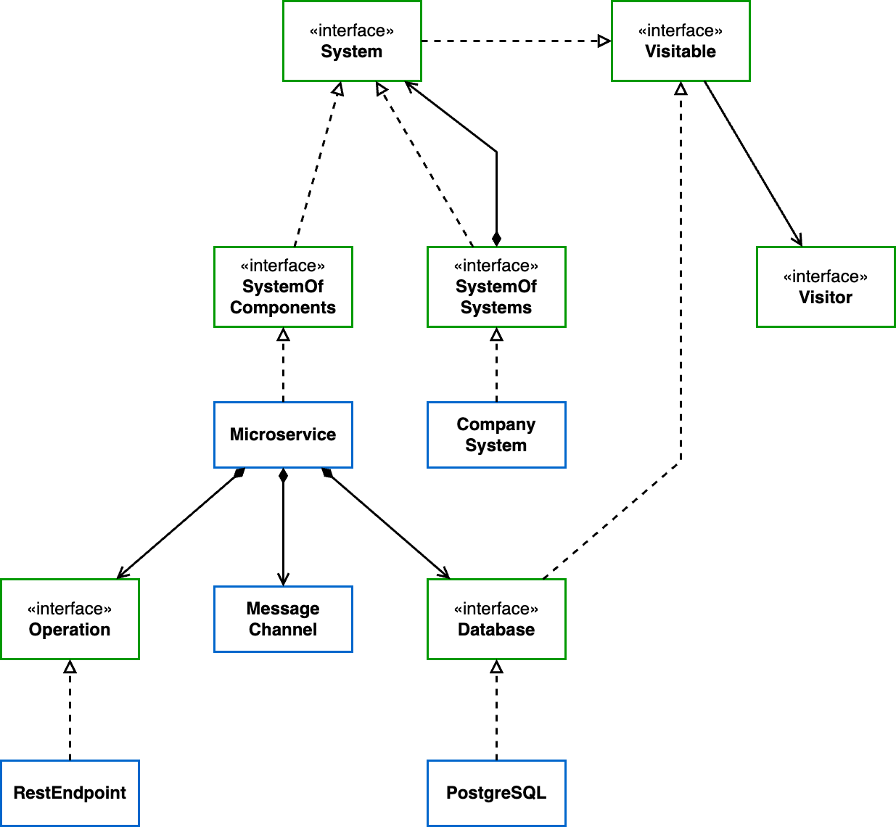

# 5. Homogeneously analyze Systems and Microservices

Date: 2023-10-16

## Status

Accepted

## Context

Architectural structures that are present in a microservice usually affect its surroundings.
Microservices and Systems of Microservices can be perceived as different levels of the same abstraction.

## Decision

Implement CompanySystem and Microservice as classes that belong to the same Composite.

## Consequences

Analyses and detections can be targeted to perform on either one.
It's still possible to run analyses or detections into each one specifically.
Some of the algorithms become recursive, which can be perceived as more complex.

## Illustration

Classes diagram of the module `app-model`. There are three regions in this diagram:

- the business abstractions to model the domain
  - CompanySystem
  - Microservice
  - Operation
  - Message Channel
  - Database
- the Composite pattern to treat homogeneously the abstractions
  - System (the component)
  - System of Systems (the composite)
  - System of Components (the leaf)
- the Visitor pattern to allow seamless addition of behavior to the model without the need to change its classes
  - Visitable
  - Visitor

