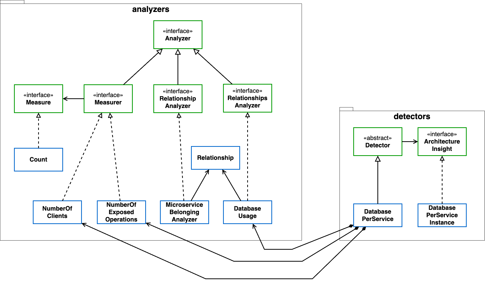

# 7. Detection depends exclusively on metrics

Date: 2023-10-16

## Status

Accepted

## Context

The tool follow a metric-based approach.
Analyses can be done on the model in different shapes, such as metrics and structural features.

## Decision

Detections depend exclusively on metric and results of analyses.

## Consequences

Detections are decoupled from the model, supported solely by the results of the analyses.
This requires a broader set of analyses to be available, not only metrics but also structural features.

## Illustration

Sequence diagram and a dependency matrix of the reports generation. This process triggers the analyzers and the detectors.

It's important to notice there's no connection between a Detector and a System. In the diagram, you can notice there's no calls between Detector and System; in the matrix, in the column "Detector" the cell in the row "System" is empty.

|                   | Report Supervisor | Planner | Executioner | System | Detector | Analyzer |
|-------------------|-------------------|---------|-------------|--------|----------|---------|
| Report Supervisor | -                 |         |             |        |          |         |
| Planner           | 1                 | -       |             |        |          |         |
| Executioner       | 1                 |         | -           |        |          |         |
| System            |                   |         | 1           | -      |          |         |
| Detector          |                   | 1       | 2           |        | -        |         |
| Analyzer          |                   | 1       |             | 1      | 1        | -       |

## How to create a new detection

Detection is based solely on the results of analyses -- directly or indirectly --, and they can generate a variety of results, such as patterns and bad smells. More basic detections depend directly on the results of some analyses, but there might be some more complex detections that also benefit from other detections.

Whatever degree of complexity your new detection has, you only need to create a new class that extends the `Detector` abstract class, that takes in its constructor all the `Analyzer`s and `Detector`s it depends on, and, as outcome of the `getResults` method, provides an implementation of `ArchitecturalInsight`. The diagram below shows what is currently implemented.

> All the detectors **must be placed inside the com.usvision.analyses.detector package** otherwise it won't be available for the external clients

