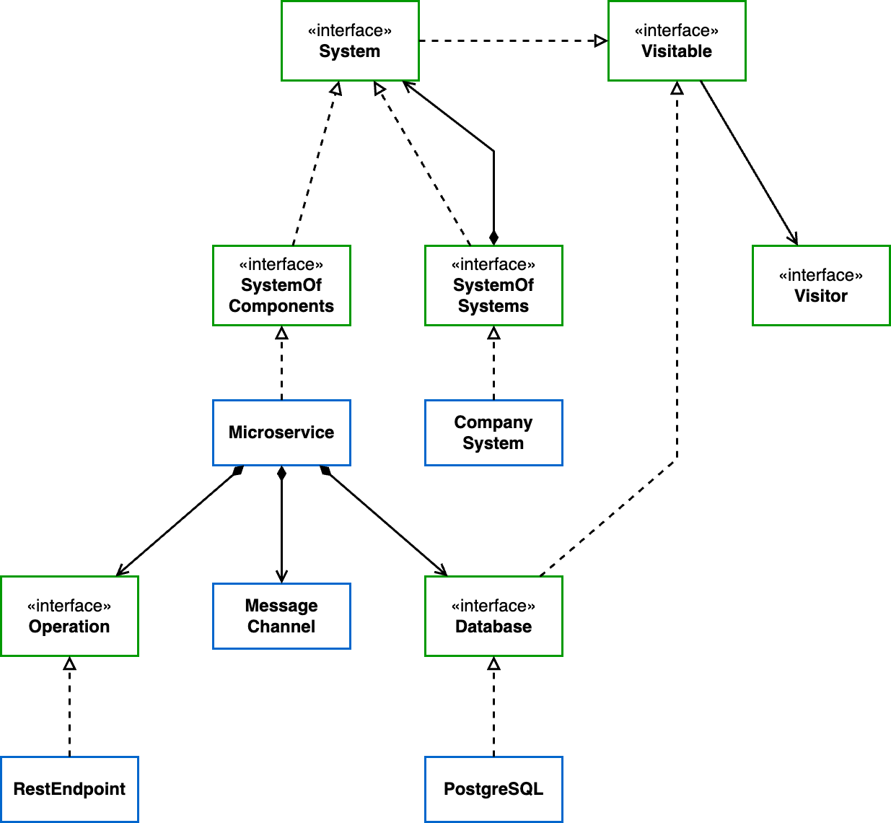

# 8. Metric evaluation is separated from the model

Date: 2023-10-17

## Status

Accepted

## Context

Metric evaluation is an important task of the application.
There are a few metrics so far, but there's an expectation to be more in the future.
For this application, there are different NFRs for metric evaluation from the model ones.

## Decision

Metric evaluation is separated from the model.

## Consequences

Changes in the metrics don't affect the model, hence there's more isolation for both sides.
From that, we achieve more cohesive classes in the model and in the metric evaluation.
The model must provide an extensible access point, such as the Visitor pattern.

## Illustration

We present the classes diagram of the two modules involved in this decision: the `app-model`, and the `app-analyses`. In the first, it's important to highlight the model being abstracted by the interface `Visitable`, which has a relationship with `Visitor`. In the second, the interface `Analyzer` represent the metrics evaluation. It's not explicitly represented, but the interface `Analyzer` extends `Visitor`, which is the connection point between the two modules. Because of this decision, the model only needs to be aware of the `Visitor`.

## How to create a new metric evaluation

In this application, a metric evaluation is not the only analysis we make on the model. We also support other structural information collection. Because of that, we created a generalization, an interface called `Analyzer`. There are already three interfaces extending it, they are:

- `Measurer` represents the objective metrics, such as `NumberOfExposedOperations`;
- `RelationshipAnalyzer` collects information about singular relationships between parts of the model, e.g. the `MicroserviceBelongingAnalyzer` that identified to which CompanySystem a Microservice belongs;
- `RelationshipsAnalyzer` is very similar to the analyzer above, except that this one collects information about relationships where there might be multiplicity, e.g. the `DatabaseUsage` where there might be multiple Microservices using multiple Databases.

To create a new analysis, you'll need to create a concrete class that implements `Analyzer`. You can either choose to implement one of the interfaces above, or to create a new abstraction before. Either way, it's imperative that you create a new class that, directly or indirectly, implements `Analyzer`.

> Your new analyzer will only be called when a detector requires its data

