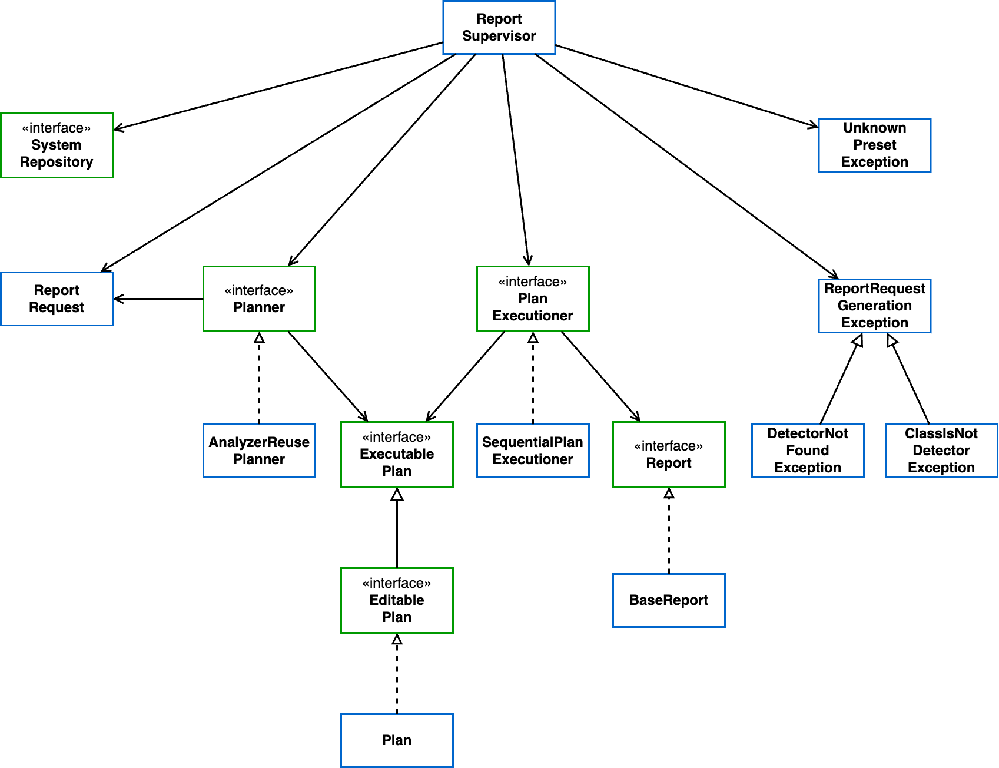

# 9. Detections can be required in a granular way

Date: 2023-10-17

## Status

Accepted

## Context

As the number of detections grows, there might be unrelated ones.
It's important to give more control to the client in terms of selecting which detections they want.

## Decision

Detections can be required in a granular way

## Consequences

Requiring detections is not a all-or-nothing process.
Different requests will typically have different detections, so it becomes important to plan the executions to avoid wasting resources in processing.

## Illustration

Here's a class diagram representing the structure of the `app-reports` module. The `ReportSupervisor` is the main class, that controls the entire workflow by delegating tasks to specific classes, such as the planning to a `Planner`, and the execution to a `PlanExecutioner`. By having interfaces abstracting their implementations, it's easy to add new strategies of planning and execution. `Planner`s must manipulate an `EditablePlan`, while `PlanExecutioner`s only require processing `ExecutablePlan`s, that's why the editable interface extends the executable one, and a `Plan` implements the editable one.

The result of a detection workflow is a `Report`, which is abstracted to opens the architecture for the adoption of the Decorator pattern, allowing the addition of behavior to a `Report` without changing the `BaseReport` class. 

